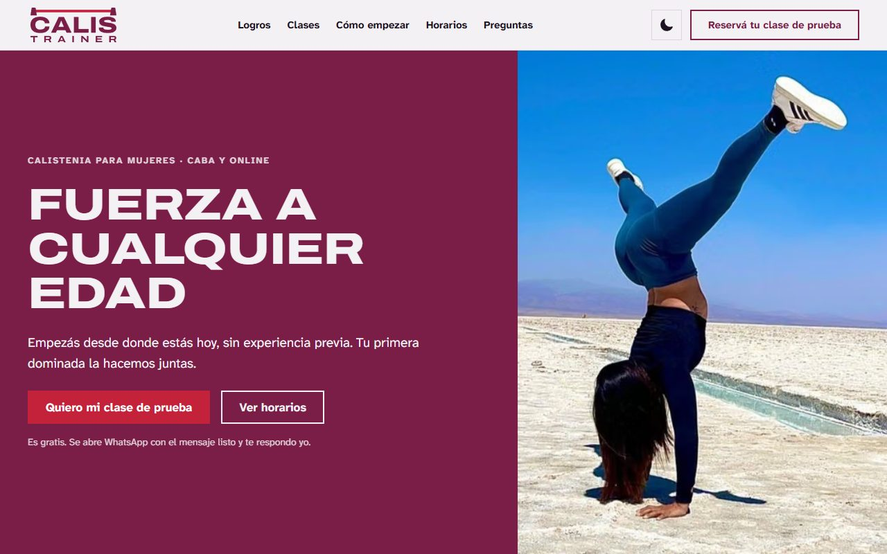
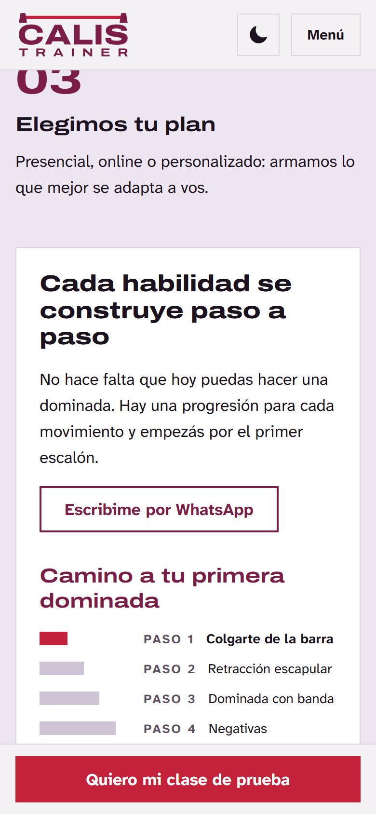
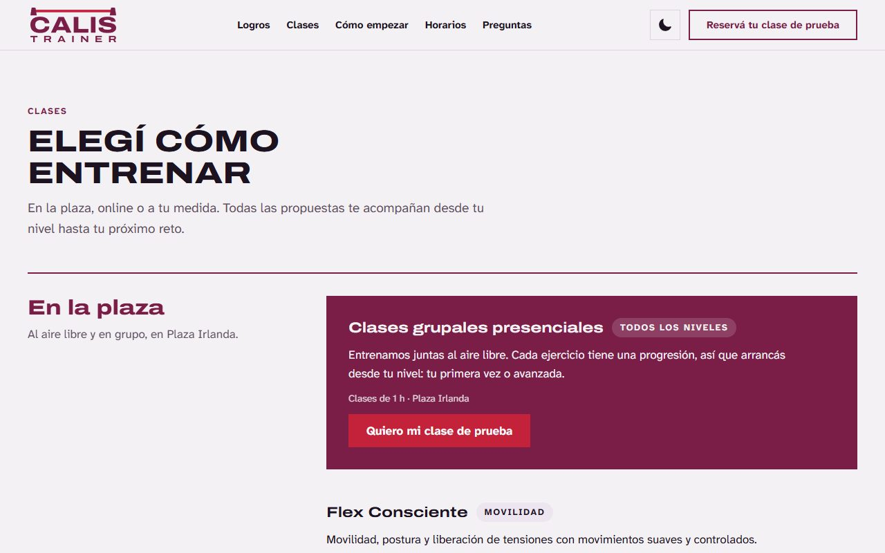
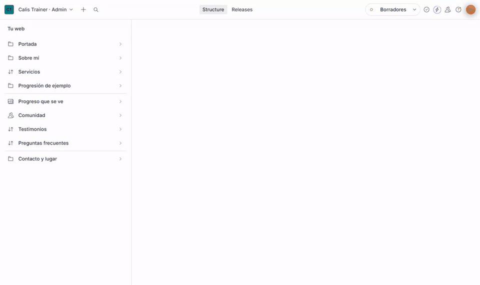

# Calis Trainer

Web y panel de administración para Johanna (@calis.trainer), entrenadora de calistenia para mujeres en Caballito (CABA) y online. Fue un trabajo freelance que hice sola, de mediados de agosto a fines de septiembre de 2026. Arrancó con una investigación de mercado para definir la identidad de la marca. Terminó con la web publicada, un admin para que ella actualice el contenido y un manual de uso.

## Problema que resuelve

Johanna da clases desde 2022. Tenía su cuenta de Instagram, pero no una marca definida. El contenido (su historia, sus clases, las fotos, los videos) lo aportó ella; yo lo ordené y ajusté los textos al tono de la marca. La web tenía un objetivo concreto: que quien entra reserve una clase de prueba por WhatsApp.

El desafío técnico estaba en otro lado. El contenido cambia seguido, sobre todo las fotos y los videos de las alumnas, pero Johanna no programa. Necesitaba editar todo sola, sin romper el diseño ni volver pesada la web en el celular.

## Demo

**Web en producción:** https://calis-trainer-web.vercel.app

| Escritorio | Celular |
|---|---|
|  |  |

**Panel de administración.** En el GIF difuminé las fotos de las alumnas, los testimonios y la cuenta de usuario.

Las fotos, los videos, los nombres de los testimonios y el número de WhatsApp del código son de ejemplo. Los reales están solo en Sanity, para no dejar imágenes ni datos de las alumnas en un repo público.

## Tecnologías

- **Astro 7** con **TypeScript** para la web, que se genera estática.
- **CSS propio**, sin frameworks, basado en el kit de marca.
- **Sanity Studio 6** como admin, en español.
- **Sanity** para guardar el contenido y servir las imágenes optimizadas.
- **Vercel** para publicar la web.

## Cómo funciona

Antes de escribir código investigué el mercado. Revisé cómo comunican las escuelas de calistenia, las marcas de fitness para mujeres y la competencia más cercana en CABA. La calistenia suele usar negro, colores neón y un tono masculino de "street workout". El fitness para mujeres, en cambio, usa rosa o pasteles para hablar de "tonificar". Para diferenciarla propuse un granate violáceo como color principal, una tipografía ancha y firme, con un mensaje centrado en la fuerza a cualquier edad: nada de peso ni de talles. De esa base salieron el logo, la paleta, el tono y los componentes de la web.

Johanna edita el contenido en el admin. Cuando publica, la web se vuelve a generar sola en uno o dos minutos.

Las decisiones que tomé y por qué:

- **Web estática.** El contenido cambia cuando Johanna publica, no en cada visita. Por eso la web se genera de antemano: carga rápido, sin un servidor que mantener.
- **Imágenes a la medida de cada pantalla.** Cada foto existe en varios tamaños. El celular descarga la más chica que le sirve, así una galería llena de fotos no vuelve lenta la página.
- **Un admin pensado para alguien que no programa.** Está en español, con un menú que sigue las secciones de su web. Lo que podría romper el diseño está bloqueado o validado: las páginas principales no se pueden borrar, cada foto pide una descripción, un video de más de 15 segundos no se acepta. Cada aviso le dice qué hacer, por ejemplo recortar el video desde la galería del celular. La idea es que pueda actualizar la web sin depender de mí.
- **Los testimonios necesitan permiso.** Solo se publican los que Johanna marcó como autorizados, incluso los que cargué yo al principio. Así nadie aparece en la web sin haber aceptado.
- **Un solo llamado principal a la vez.** Hay un único botón fuerte en pantalla; el resto de las acciones son enlaces. Cada servicio abre WhatsApp con un mensaje ya escrito para esa clase. Quien visita sabe qué tocar, mientras que Johanna sabe por qué clase le escriben.
- **Accesible para más personas.** Los videos arrancan sin sonido, solo mientras se ven. Si alguien tiene activado "reducir movimiento", no se reproducen solos. También tiene modo oscuro.
- **Preparada para buscadores.** Los datos del lugar y las preguntas frecuentes se publican en el formato que leen Google y otros buscadores, armados con el mismo contenido del admin.

Algunas cosas quedan fijas en el código a propósito: el orden de las secciones, los colores, las tipografías, los textos que salen de los valores de marca. Así la marca se sostiene aunque cambie el contenido.

**La entrega.** Además del link de la web y el admin, le entregué un manual de uso de 16 páginas. Explica cómo editar cada sección, qué significan los avisos del admin, cómo deshacer un cambio. También resume su marca: colores, tipografías, logo, fotos, tono. No está en el repo porque es material de uso interno de la clienta.

## Qué aprendí y qué mejoraría

**Qué aprendí**

- Que el trabajo empieza antes del código. La marca no tenía identidad, así que investigué el mercado para proponerle una. Esa investigación me dio argumentos para cada decisión de diseño.
- A diseñar un admin para alguien que no programa: anticipar lo que puede salir mal, explicar cada error en sus palabras.

**Qué mejoraría**

- Incluir el dominio propio en las webs que hago. Esta quedó en un subdominio de `vercel.app`. Con un dominio propio la marca se ve más profesional, además de ser más fácil de recordar.
- Sumar tests automáticos. Hoy la verificación es manual.
